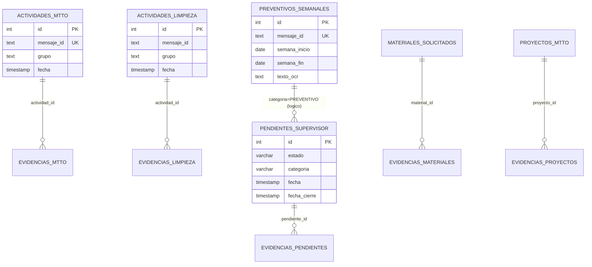

# Guia Tecnica del Sistema - Parte 1 (V1)

## Objetivo
Esta Parte 1 documenta el estado real del sistema, tablas activas, tablas candidatas a retiro y optimizaciones propuestas sin aplicar cambios destructivos al esquema.

## Alcance de la revision
- Inventario de tablas en PostgreSQL con filas y tamano.
- Cruce contra uso real en codigo (api, handlers, services, lib, utils, monitor).
- Revision de indices y llaves foraneas.
- Plan de limpieza y optimizacion para ejecutar en Parte 2 (V2).

## Resumen Ejecutivo
- El sistema activo usa principalmente 15 tablas operativas.
- Hay 8 tablas candidatas a retiro por no uso en codigo runtime (varias con 0 filas).
- El esquema actual funciona, pero faltan algunos indices compuestos para consultas frecuentes.

## Tablas activas en runtime
1. actividades_mtto
2. evidencias_mtto
3. actividades_limpieza
4. evidencias_limpieza
5. asistencia_limpieza_diaria
6. asistencia_limpieza_ajustes
7. asistencia_mantenimiento_eventos
8. mantenimiento_fallas
9. pendientes_supervisor
10. preventivos_semanales
11. materiales_solicitados
12. proyectos_mtto
13. evidencias_pendientes
14. evidencias_materiales
15. evidencias_proyectos

## Tablas candidatas a retiro (no referenciadas en codigo runtime)
1. actividades_mtto_backup (filas estimadas: 0)
2. actividades_supervisor_historico (filas estimadas: 5)
3. alertas_operativas (filas estimadas: 0)
4. eventos_sistema (filas estimadas: 0)
5. incidentes_mtto (filas estimadas: 0)
6. inventario_materiales (filas estimadas: 0)
7. movimientos_inventario (filas estimadas: 0)
8. preventivos_programados (filas estimadas: 0)

Nota: candidatas a retiro no significa borrado inmediato. Deben pasar por validacion funcional y respaldo previo.

## Relacion funcional de datos

## Indices actuales relevantes
- pendientes_supervisor: estado, fecha, prioridad, pkey
- actividades_mtto: mensaje_id (unique), fecha, grupo, tecnico, area, autor_numero+grupo+creado_en
- actividades_limpieza: fecha, area, pkey
- asistencia_limpieza_diaria: unique(fecha,autor,grupo), pkey
- asistencia_mantenimiento_eventos: mensaje_id (unique), pkey
- preventivos_semanales: mensaje_id (unique), pkey

## Optimizaciones recomendadas (Parte 2 / V2)
1. Agregar indice compuesto en pendientes_supervisor para listados operativos:
   - (estado, categoria, fecha DESC)
2. Agregar indice compuesto en actividades_limpieza para consultas por supervisor:
   - (grupo, fecha DESC)
3. Agregar indice por semana en preventivos_semanales:
   - (semana_inicio, semana_fin)
4. Estandarizar valores OCR de salida (ya iniciado en app) y no persistir ruido en descripcion final.

## Riesgos antes de eliminar tablas
1. Cambios no referenciados en codigo pueden estar siendo usados por consultas manuales externas.
2. Tablas con 0 filas pueden ser parte de procesos futuros no desplegados.
3. movimientos_inventario tiene FK a inventario_materiales; si se elimina una, validar ambas juntas.

## Plan sugerido de ejecucion
1. Respaldar base completa.
2. Ejecutar script de pre-chequeo y snapshot de conteos.
3. Eliminar solo tablas candidatas acordadas.
4. Crear indices recomendados.
5. Validar API y comandos de bot.
6. Documentar como Parte 2 (V2).

## Entregables Parte 1
- Esta guia tecnica: docs/guia-tecnica-parte-1-v1.md
- Script tecnico de candidatos/indices: scripts/db-parte1-candidatos-v2.sql
